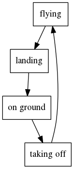
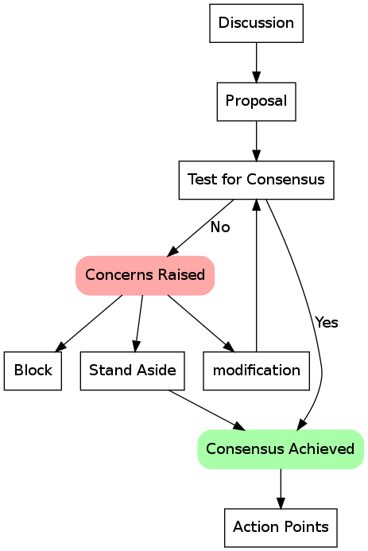
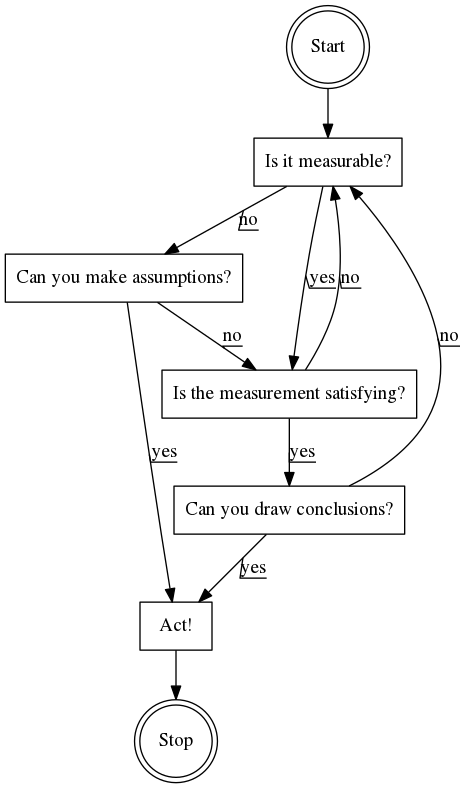
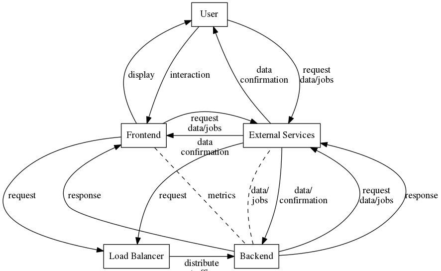
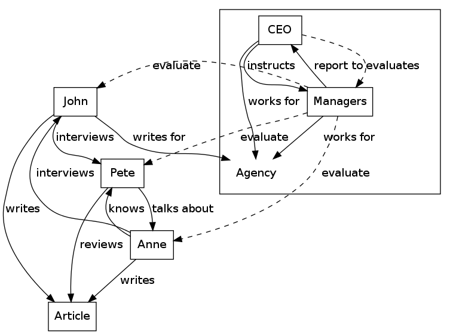
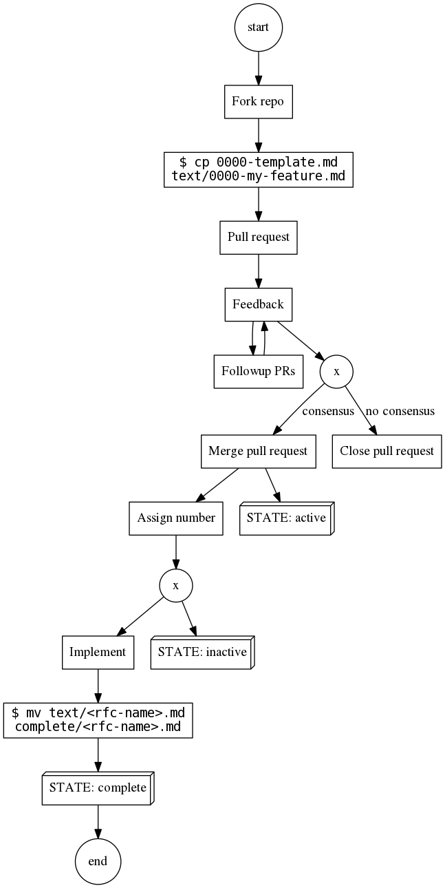
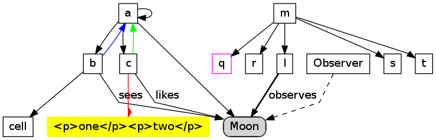
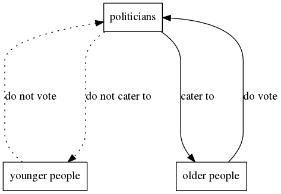

# Graphviz Examples

**`airplane/`**

-----------

**`consensus/`**

-----------

**`flowchart/`**

-----------

**`foo/`**

-----------

**`graph/`**

-----------

**`rfc/`**

-----------

**`test/`**

-----------

**`voting/`**

